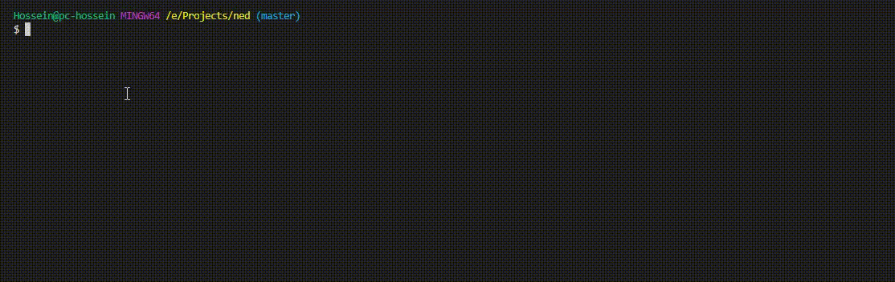

## Ned Library

**Ned is:** a Super Light VanillaJS library with the ability of the big frameworks for creating a single-page web application. It gives your application Component and Module features for longer maintainable and scalable project support without worry about the complexity of your project in the feature.

Ned comes with CLI so you can run `npm i -g ned-lib-cli` and use the command line to manage your project.


## How start project with Ned

<!--ts-->
* [Installation](#Installation)
  * [Project File tree](#project-file-tree)
  * [Project Configuration](#project-configuration)
  * [Ned Add](#add-router)
    * [Router](#add-router)
      * [Component](#add-componet)
      * [Module](#add-module)
  * [Develop](#develop)
  * [Deploy](#deploy)
  * [Develop and Contribute](#Develop-and-Contribute)
  * [Quick Links, subsystem projects](#Quick-Links)
<!--te-->

## Installation

Ned library bring you `cli` to manage and develop your project easily, <a href="https://github.com/HosseinMarzban/ned-cli"> ReadMore </a>
> install globally ned cli, then create your first project.

```shell
npm install -g ned-lib-cli
$ ned new <projectName>
```

**`<projectName>`** : Name of your Project or Directory you wanna create a starter Project

### Cli Demo



## Project File tree

After you create your first project `ned cli` gives you starter pack to start and develop.

```bash|-- undefined
    |-- .gitignore
    |-- app.js
    |-- directoryList.md
    |-- LICENSE
    |-- nodemon.json
    |-- package-lock.json
    |-- package.json
    |-- README.md
    |-- app
        |-- src
            |-- favicon.ico
            |-- index.html
            |-- ned.config.js
            |-- assets
            |   |-- img
            |   |-- js
            |   |   |-- jquery-3.3.1.min.js
            |   |   |-- main.script.js
            |   |   |-- ned_bundle.js
            |   |   |-- ReadyStage.js
            |   |-- style
            |       |-- main.style.css
            |-- components
            |   |-- header
            |       |-- header.component.page.html
            |       |-- header.component.script.js
            |       |-- header.component.style.css
            |-- pages
                |-- about
                |   |-- about.route.page.html
                |   |-- about.route.script.js
                |   |-- about.route.style.css
                |-- home
                    |-- home.route.page.html
                    |-- home.route.script.js
                    |-- home.route.style.css
```

## Project Configuration

In `./app/src/` we have a file with the name of `ned.config.js`. with this file `cli` and project dependency injection logics set and handle.
We have a property called `static`, all static files you want to be loaded in the first and in the global you have to put in there,`head` or `body` it's location of your dependency injection, ***be careful about your priority of injection***.

```javascript
    static: {
        script: {
            head: [ "./assets/js/ned_bundle.js" ],
            body: [ "./assets/js/main.script.js"],
        },
        style: {
            head: ["./assets/style/main.style.css"],
            body: [],
        },
    },
```

## Add Router

If you want to add a new route you can simply run `ned add` command and chose `router`, then cli ask for the name of your router which must be unique otherwise gives you a warning. After all, if router created successfully, in the end, CLI gives you help with the code you need in your script:

```bash
[Ned Cli]: Don. Router "profile" added successfully."
[Ned Cli][Help]:You can now copy and paste router config below on your application.

//Put this config in your script/js:

app.router.add('/profile',{
 name:  "profile Page",
 html:  "./pages/profile/profile.route.page.html",
 style: "./pages/profile/profile.route.style.css",
 script:"./pages/profile/profile.route.script.js",
 controller: function(){
  /*console.log("/profile router loaded")*/
 }
});

//Put this tag in your static/html:(use just once in application)
<app-root></app-root>
```

Each router has two controller witch firsts one is in the main inline config and the other one is in the script file which you can use it like below:

```javascript
app.router.controller(function(){
 var _self = this;
}); // @router.controller()
```

**Note:** all scripts when loaded in Dom object remain, even we remove the script tag so, Ned, after the first-time script loaded to handle it inside of the controller and for the second one just invoke the controller and **rerun** the script again. So all scripts must be in the controller till Ned runs it after call route.

In the controller and call-site, you have some feature through `this`, if you console out `this` it gives you these info/data:

```javascript
[Object]:{
 info: {
  name: "About Page",
  html: "./pages/about/about.route.page.html",
  style: "./pages/about/about.route.style.css",
  script: "./pages/about/about.route.script.js",
  controller: ƒ
 },
 module: {add: ƒ, init: ƒ},
 pubsub: {events: {…}, on: ƒ, off: ƒ, emit: ƒ},
 reload: ƒ (),
 state: {
  lastPath: "/",
  path: "/about",
  name: "About Page",
  location: "/about",
  domain: "http://localhost:600"
 },
 __proto__: Object
}
```

You can get static info from `info` prop even you can invoke your inline router controller,
through each router and component, you can create a module,
by `pubsub` you can have published/subscribe strategy to access your data entire your project,
and `reload` prop gives you the ability to **reload** and **re-render** your current router for your usage proposes.

## Add Component

If you want to add a new component you can simply run `ned add` command and chose `component`, then CLI ask for the name of your component which must be unique otherwise gives you a warning. After all, if the component created successfully CLI gives you help with the code you need in your script file:

```bash
[Ned Cli]: Don. Component "footer" added successfully."
[Ned Cli][Help]:You can now copy and paste component config below on your application.

//Put this config in your script/js:
app.component.add('component-footer',{
 html:  "./components/footer/footer.component.page.html",
 style: "./components/footer/footer.component.style.css",
 script:"./components/footer/footer.component.script.js",
 controller: function(){
  /*console.log("<component-footer></component-footer> component loaded")*/
 }
});

//Put this tag in your static/html:
<component-footer></component-footer>
```

Like a router, each component has two controller witch firsts one is in the main inline config and the other one is in the script file which you can use it like below:

```javascript
app.component.controller(function(){
 var _self = this;
}); // @router.controller()
```

**Note:** all scripts when loaded in Dom object remain, even we remove the script tag so, Ned, after the first-time script loaded to handle it inside of the controller and for the second one just invoke the controller and **rerun** the script again. So all scripts must be in the controller till Ned runs it after call route.

In the controller and call-site, you have some feature through `this`, if you console out `this` it gives you these info/data:

```javascript
[Object]:{
 module: {add: ƒ, init: ƒ},
 pubsub: {events: {…}, on: ƒ, off: ƒ, emit: ƒ},
 reload: ƒ (),
 state: {
  lastPath: "/",
  path: "/",
  name: "Index Page",
  location: "/",
  domain: "http://localhost:600"
 },
 __proto__: Object
}
```

through each router and component you can create module [see add module](#add-module),
by `pubsub` you can have published/subscribe strategy to access your data entire you project.

## Add Module

The module is a small part of `component` or `router` which might repeat more than once in their target.
For add, a new module to your project run `ned add` then chose `module` after this part CLI need a target of your module witch to be a **router** or **component**,then  CLI gives a list of your component or router base on your chose ,and you should select one of the existing targets, at the end cli gives you help code like below:

```bash
[Ned Cli]: Don. Module "chart" added successfully."
[Ned Cli][Help]:You can now copy and paste module config below on your route/component.controller() application.

//Put this config in your script/js controller:

app.router.controller(function(){
 /*.......Rest of Your Code......*/
 # this.module.add({
  tag:   "module-chart",
  html:  "./pages/profile/modules/chart/chart.module.page.html",
  style: "./pages/profile/modules/chart/chart.module.style.css",
  script:"./pages/profile/modules/chart/chart.module.script.js",
 });

 /*.......Don not forget, after module configuration initial module.......*/

 this.module.init();

 /*.......Rest of Your Code......*/
});

//Put this tag in your static/html:
<module-chart></module-chart>
```

As CLI mention config of module must be in `router/component.controller()` and do not forget to pass `this.module.init();`. in the top example module **chart** tag `<module-chart></module-chart>` must be in that target(component/router) HTML file and each module you define just belong that target and you can not use somewhere else.
in module `script` file you can call module controller like below

```javascript
app.module.controller(function(){
 var _self = this;
}); //@module.controller()
```

In the controller and in call-site, you have some feature through `this` if you console out `this` it gives you these info/data:

```javascript
[Object]:{
 pubsub: {events: {…}, on: ƒ, off: ƒ, emit: ƒ},
 state: {
  lastPath: "/",
  path: "/",
  name: "Index Page",
  location: "/",
  domain: "http://localhost:600"
 },
 __proto__: Object
}
```

One more thing reminds, each module tag has its own controller, for invoking their controller you can act like below:

```javascript
app.module.controller(function () {

    let chart = document.getElementsByTagName('chart-static');

 chart[0].controller(function () {
  var _self = this;
  _self.element.querySelector('.head').innerHTML = `Module1: <b> ${_self.element.tagName} </b>`
 });

 chart[1].controller(function () {
  var _self = this;
  _self.element.querySelector('.head').innerHTML = `Module2: <b> ${_self.element.tagName} </b>`
 });
  
}); // @module.controller()
```

In this example we have a module with the name of `<chart-static></chart-static>` so we get all these tags as an array with the variable name of `chart`, now you can point each index if chart tag and get property of `controller`.
in this `controller` call-site you can get these properties:

```javascript
[Object]:{
 pubsub: {events: {…}, on: ƒ, off: ƒ, emit: ƒ},
 state: {lastPath: "/", path: "/", name: "Index Page", location: "/", domain: "http://localhost:600"},
 __proto__: Object
}
```

## Develop

> run your project and develop with ned cli

```shell
ned serve
```

it brings you up an express server on port `600` with the specific config to handle a single-page application.
You can easily change the express config in `./app.js` but be vise that, you are using SPA application and you have to redirect all server `route` to one file, which in this project is `./app/src/index.html`.

## Deploy

> publish your projection as a production

```shell
ned deploy
```

After execute this command `cli` ask you target of your serve, and you have to chose between `Nginx`, `Apache` and `node`. it gives you `dist` folder of current project with minification of your code and at last gives you config file to how serve you SPA in target serve.
<p style='color:orangered'> Still on progress in Js files</p>

### `config()` options

``` javascript
app.config({
 // html attribute for  'a' tag watch for routing.
 customAttributeNavigate:"ndHref",

 //custom tag to load route data.
 root:"app-root",

 // Default root invoke for first load.
 defaultRoot:'/'
});
```

**property**      | **default**
---         | ---
root   | `app-root`
defaultRoot   | `/`
customAttributeNavigate   | `ned-href`

`customAttributeNavigate` and `root` usage in `html`:

``` html
<a href="/posts/archive" ndHref> Posts Archive </a>
<a href="http://www.google.com"> Google Search </a>

<!-- after config 'root' you should add manually your root tag in body of your html -->
<app-root></app-root>
```

## How to use in real world project

I'm working on it

## How Ned Library work

I'm working on it

**Better mention**, I do not plan to add an engine template, just router, and component. And for DOM manipulation you can use JQUERY or Vanilla Js ( JS native ) or whatever library exists for manipulating DOM.

## The story behinds of Ned library

I like SPA applications and always inspire it. How can we control all our applications in just one page? Now we have a lot of libraries and frameworks out there like Ember.js, Angular, React, Vue.js, and so on. All these are awesome and admirable.

But some aspects of these frameworks really butter me through these years and it is the new version with new change look features! It's the duty of programmers to be on the edge of learning, but in this case, it is too hard and time-consuming to adapt and find out the new concept of frameworks to our existing project and update or migrate our project to the Major version of them.

Let me bring out an example, when I familiar with SPA framework, there were no more chosen, so I chose angular, I start from angular 1.2 to 1.4.6, It was so good and give me the ability to bring out my complex logic to front-end without any complexity or worry about feature maintenance. I developed continuously for almost 4 years during these year lunches and developed lots of applications with the angular legacy, and everything was awesome, till I came to myself and realized we have a bunch of cool and awesome frameworks with the big and growing community out there.

So I started learning the new version of the angular witch came with typescript. In the first release it was great, but after a while when the new major version comes out, it becomes a headache and it really drives me crazy and I can not tolerate these bunches of changes for my applications. (and these major changes coming out continuously)

Meanwhile, I looked up the other options like React or Vue.js, these two are really amazing, but still have that kind of issue I had with new angular, the issue is communicating and working with the old concept of plugins or components written before them.

It is right, and we have to accept it, we have a lot of plugins, widgets, and components out there that's written and continually developing with jQuery or native script. So if we want to use one of them in those frameworks, we have to change the structure of these useful plugins to a base of target framework and it's really painful in some cases and more importantly, time-consuming especially when your boss needs a project in a short time.

So, for me as an old fashioned developer, it's really hard to migrate and learn and makes time to make changes for all plugin witches written in jQuery to Vue.js or React.

The other painful thing is the fight of which of these frameworks is better than the other and it's really hard to choose between these good frameworks.

After all, I decided to get rid of this situation, so I started to develop a library which just handles Router of SPA and has the ability to tear out an application in parts, to approach 

## Develop and Contribute

1. `git clone` then change to `base_modular` branch
2. `npm i` install dependency
3. `npm i -g tscw-cli` install watcher in global access
3. `tscw serve -d` run watcher for change and develope your code

## Quick Links

- <a target="_blank"  href="https://github.com/HosseinMarzban/ned">ned</a>
- <a target="_blank"  href="https://github.com/HosseinMarzban/ned-cli">ned-cli</a>
- <a target="_blank"  href="https://github.com/HosseinMarzban/tscw">tscw-cli</a>
- <a target="_blank"  href="https://github.com/HosseinMarzban/ned-seed">ned-seed</a>
- <a target="_blank" href="https://github.com/HosseinMarzban/ned-shards-dashboard-lite"> Ned Shards Dashboard Lite </a>
